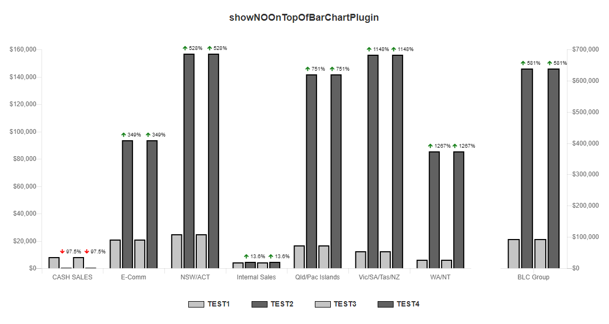

# chartjs-plugin-bar-chart-annotation

[![NPM Version][npm-image]][npm-url]
[![License Stats][npm-license]][npm-url]
[![Downloads Stats][npm-downloads]][npm-url]
[![Github stars][github-stars]][github-url]
[![Github issues][github-issues]][github-issues-url]
<!-- [![Build Status][travis-image]][travis-url] -->

> Bar chart annotation for Chart.js

[![nodei.co][npm-io]][npm-url]


## Installation

```sh
npm install chartjs-plugin-bar-chart-annotation --save
```

## Usage example

```sh
const barChartAnnotationPlugin = require("../src/index");

const {
  clearPlugins,
  showNOOnTopOfBarChartPlugin,
  showNOOnBottomOfBarChartPlugin,
  showInfoOnTopOfBarChartPlugin
} = barChartAnnotationPlugin;

const Chart = {}; // Should require('chart.js');
```

```sh
// Just in case one plguin gets registered twice
clearPlugins(Chart, [
  showNOOnTopOfBarChartPlugin
]);

Chart.pluginService.register(showNOOnTopOfBarChartPlugin);
```


```sh
// Just in case one plguin gets registered twice
clearPlugins(Chart, [
  showNOOnBottomOfBarChartPlugin
]);

Chart.pluginService.register(showNOOnBottomOfBarChartPlugin);
```


```sh
// Just in case one plguin gets registered twice
clearPlugins(Chart, [
  showInfoOnTopOfBarChartPlugin
]);

Chart.pluginService.register(showInfoOnTopOfBarChartPlugin);
```


_For more examples and usage, please refer to the [Wiki][wiki]._

## Development setup

```sh
git clone git@github.com:nerdmax/chartjs-plugin-bar-chart-annotation.git
cd chartjs-plugin-bar-chart-annotation
npm install
```

## Release History

<!-- * 0.2.1
    * CHANGE: Update docs (module code remains unchanged)
* 0.2.0
    * CHANGE: Remove `setDefaultXYZ()`
    * ADD: Add `init()`
* 0.1.1
    * FIX: Crash when calling `baz()` (Thanks @GenerousContributorName!)
* 0.1.0
    * The first proper release
    * CHANGE: Rename `foo()` to `bar()` -->
* 0.0.1
    * Put all source code here, work in progress

## Meta

Max LIU – [My personal website](#) – mrliucan@foxmail.com


## Contributing

1. Fork it (<https://github.com/nerdmax/chartjs-plugin-bar-chart-annotation/fork>)
2. Create your feature branch (`git checkout -b feature/fooBar`)
3. Commit your changes (`git commit -am 'Add some fooBar'`)
4. Push to the branch (`git push origin feature/fooBar`)
5. Create a new Pull Request

<!-- Markdown link & img dfn's -->
[npm-image]: https://img.shields.io/npm/v/chartjs-plugin-bar-chart-annotation.svg?style=flat-square
[npm-url]: https://www.npmjs.com/package/chartjs-plugin-bar-chart-annotation
[npm-license]: https://img.shields.io/npm/l/chartjs-plugin-bar-chart-annotation.svg
[npm-downloads]: https://img.shields.io/npm/dm/chartjs-plugin-bar-chart-annotation.svg?style=flat-square
[github-url]: https://github.com/nerdmax/chartjs-plugin-bar-chart-annotation
[github-issues]: https://img.shields.io/github/issues/nerdmax/chartjs-plugin-bar-chart-annotation.svg
[github-issues-url]: https://github.com/nerdmax/chartjs-plugin-bar-chart-annotation/issues
[github-stars]: https://img.shields.io/github/stars/nerdmax/chartjs-plugin-bar-chart-annotation.svg
[travis-image]: https://img.shields.io/travis/dbader/node-chartjs-plugin-bar-chart-annotation/master.svg?style=flat-square
[travis-url]: https://travis-ci.org/dbader/node-chartjs-plugin-bar-chart-annotation
[npm-io]: https://nodei.co/npm/chartjs-plugin-bar-chart-annotation.png?downloads=true&downloadRank=true&stars=true
[wiki]: https://github.com/nerdmax/chartjs-plugin-bar-chart-annotation/wiki
